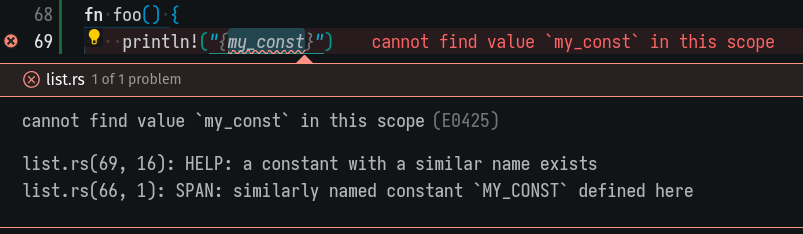
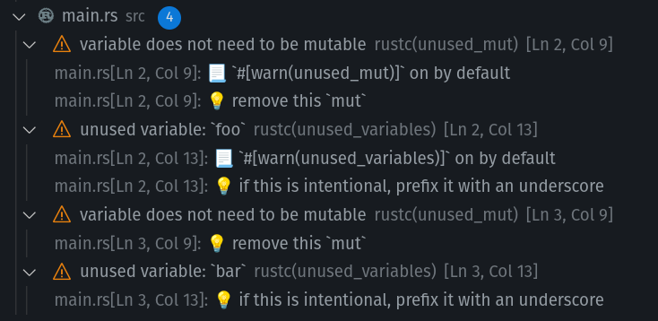
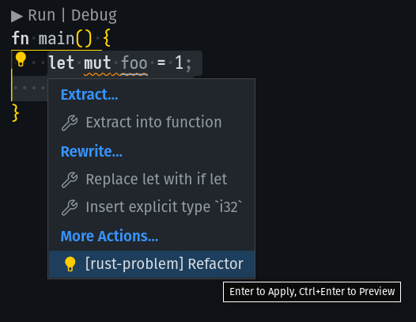
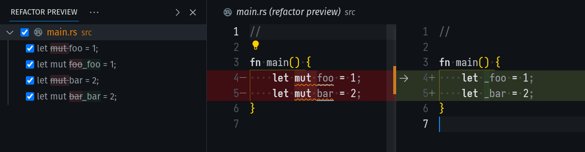

# Rust Problems

A task provider for rust tasks that uses a custom problem matcher to provide additional information, quick-fix solutions and refactorings for warnings and compile errors.

* Includes quick-fixes for problems even if the fixes aren't guaranteed to be correct
* The problem view will include `help` attachments
* The problem view will include `note` attachments
* The problem view will include additional spans as attachments

## Example





## Refactor

rust-problem will inject a custom refactoring suggestion based on your current selection. This allows you to apply multiple problem suggestions at once.





## Autofix

Some problems will be marked as preferred, which makes them work with vscode's auto fix. The default shortcut is `shift + alt + .`, but you can overwrite it with something like this, then all you have to do is to place your cursor at the problem and hit `alt+f`.

```json
{
    "key": "alt+f",
    "command": "editor.action.autoFix",
    "when": "editorTextFocus && !editorReadonly && supportedCodeAction =~ /(\\s|^)quickfix\\b/",
    "args": {
        "apply": "first"
    }
},
```

## How to Install & Use

### Installation

1. Download the latest release from our [releases](https://github.com/rasviitanen/rust-problems/releases)
2. Open vscode and press `ctrl + shift + p` to open the command palette
3. Seach for and run `Extensions: Install from VSIX`
4. Select the downloaded extension
5. All done!

### Usage

1. Open vscode and press `ctrl + shift + p` to open the command palette
2. Search for `Tasks: Run Task`
3. Move the cursor to the `rust-problem` collection, hit enter
4. Pick your task and run it!
5. Upen up the problems view to see the encountered warnings and errors (`ctrl + shift + m`)
6. You can view the raw output in a terminal tab

## Why?

When using `rust-analyzer` and their provided pattern matchers, some information is unforunately lost in the void. For example, the `notes`, `help` and additonal `spans` are erased and you end up with only the top-level message in your problems view. Another issue with `r-a` is that some quick-fixes aren't suggested, such as automatically inserting missing lifetimes.

For example, running cargo check with `r-a` on this code:

```rust
struct MissingLifetime {
    foo: &str,
}
```

The error view receives this information:

```json
{
 "resource": "/home/rasviitanen/GitHub/MdMap/src/list.rs",
 "owner": "rustc",
 "code": "E0106",
 "severity": 8,
 "message": "missing lifetime specifier",
 "source": "rustc",
 "startLineNumber": 67,
 "startColumn": 10,
 "endLineNumber": 67,
 "endColumn": 10
}
```

But with `Rust Problems` we can squeeze in some extra information:

```json
{
 "resource": "/home/rasviitanen/GitHub/MdMap/src/list.rs",
 "owner": "rustProblems",
 "code": "E0106",
 "severity": 8,
 "message": "missing lifetime specifier",
 "startLineNumber": 67,
 "startColumn": 10,
 "endLineNumber": 67,
 "endColumn": 11,
 "relatedInformation": [
  {
   "startLineNumber": 67,
   "startColumn": 11,
   "endLineNumber": 67,
   "endColumn": 11,
   "message": "HELP: consider introducing a named lifetime parameter",
   "resource": "/home/rasviitanen/GitHub/MdMap/src/list.rs"
  },
  {
   "startLineNumber": 67,
   "startColumn": 10,
   "endLineNumber": 67,
   "endColumn": 11,
   "message": "SPAN: expected named lifetime parameter",
   "resource": "/home/rasviitanen/GitHub/MdMap/src/list.rs"
  }
 ]
}
```

And also add a quick-fix to replace this with:

```rust
struct MissingLifetime<'a> {
    foo: &'a str,
}
```
