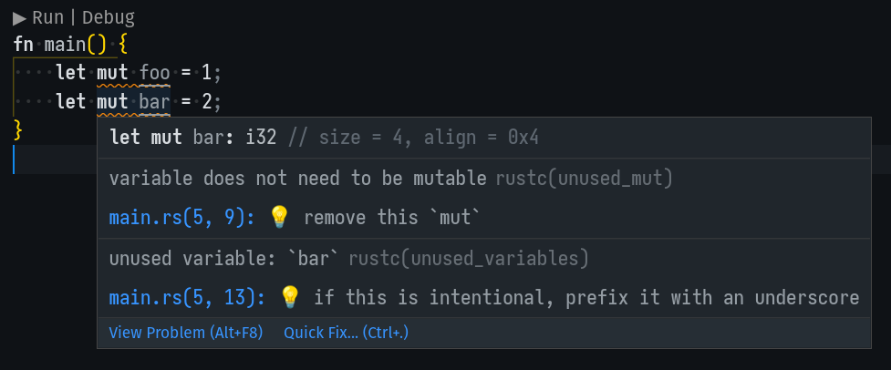

# Rust Problems

A task provider for rust tasks that uses a custom problem matcher to provide additional information and quick-fix solutions for problems.

* Includes quick-fixes for problems even if the fixes aren't guaranteed to be correct
* The probblem view will includes `help` messages as `HELP` attachments
* The probblem view will includes `note` messages as `NOTE` attachments
* The probblem view will includes additional spans as `SPAN` attachments

## Why?

When using `rust-analyzer` and their provided pattern matchers, some information is unforunately lost in the void. For example, the `notes`, `help` and additonal `spans` are erased and you end up with only the top-level message in your problems view. Another issue with `r-a` is that some quick-fixes aren't suggested, such as automatically inserting missing lifetimes. 

For example, running cargo check with `r-a` on this code:

```
struct MissingLifetime {
    foo: &str,
}
```

The error view receives this information:
```
{
	"resource": "/home/rasviitanen/GitHub/MdMap/src/list.rs",
	"owner": "rustc",
	"code": "E0106",
	"severity": 8,
	"message": "missing lifetime specifier",
	"source": "rustc",
	"startLineNumber": 67,
	"startColumn": 10,
	"endLineNumber": 67,
	"endColumn": 10
}
```

But with `Rust Problems` we can squeezy out some extra information:
```json
{
	"resource": "/home/rasviitanen/GitHub/MdMap/src/list.rs",
	"owner": "rustProblems",
	"code": "E0106",
	"severity": 8,
	"message": "missing lifetime specifier",
	"startLineNumber": 67,
	"startColumn": 10,
	"endLineNumber": 67,
	"endColumn": 11,
	"relatedInformation": [
		{
			"startLineNumber": 67,
			"startColumn": 11,
			"endLineNumber": 67,
			"endColumn": 11,
			"message": "HELP: consider introducing a named lifetime parameter",
			"resource": "/home/rasviitanen/GitHub/MdMap/src/list.rs"
		},
		{
			"startLineNumber": 67,
			"startColumn": 10,
			"endLineNumber": 67,
			"endColumn": 11,
			"message": "SPAN: expected named lifetime parameter",
			"resource": "/home/rasviitanen/GitHub/MdMap/src/list.rs"
		}
	]
}
```

And also add a quick-fix to replace this with:
```rust
struct MissingLifetime<'a> {
    foo: &'a str,
}
```

## Example

Here is an example with an included span and help attachment:



By clicking the lightbulb (or any quick-fix hotkey), you get an option to fix this issue automatically by replacing `my_const` with `MY_CONST`.
